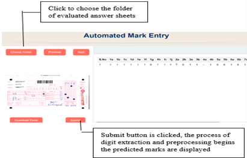
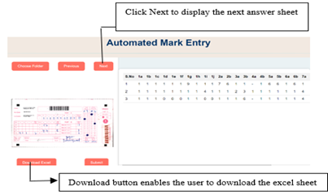
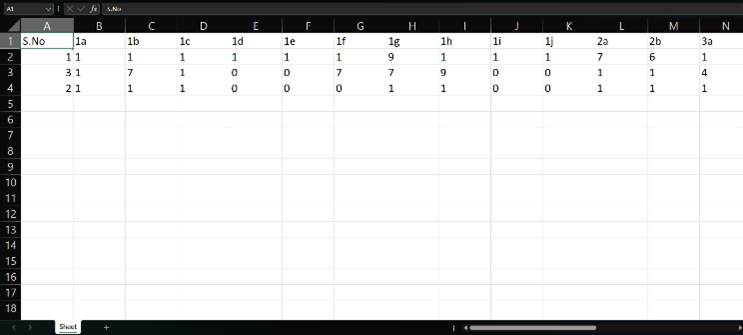

# Intelligent-Learning-Report-Generation-System
AI-powered system for automatic generation of structured assessment reports using OCR and CNN-based analysis.

📖 Project Overview

The Intelligent Learning Report Generation System is a Python-based AI platform designed to automatically extract handwritten marks from student answer sheets and generate structured Excel reports. The system leverages:

1. Optical Character Recognition (OCR) for extracting handwritten marks from scanned answer sheets.

2. Convolutional Neural Networks (CNNs) trained on the MNIST dataset (60,000 training and 10,000 testing images) for accurate digit recognition.

3. Predefined Regions of Interest (ROIs) tailored to our college’s answer sheets, ensuring precise extraction of marks.

4. Excel report generation for seamless export and analysis of results.

Note: The system is customized for the first page of our college’s semester answer booklets. Predefined ROIs are specific to these sheets.

🧠 Technical Details
1. CNN Model

The model is a deep CNN implemented in TensorFlow/Keras:

Architecture:

Conv2D → BatchNormalization → MaxPooling → Dropout

Conv2D → BatchNormalization → MaxPooling → Dropout

Flatten → Dense → BatchNormalization → Dropout → Dense (Softmax for 10 classes)

Training Data: MNIST dataset (28×28 grayscale images, normalized).

Data Augmentation: Rotation, zoom, shift, shear to improve generalization.

Performance: Trained on 60k MNIST images with 30 epochs.

2. Predefined ROIs

The system expects input images of the first page of semester answer booklets. ROIs are manually defined coordinates corresponding to each question’s mark field. The system:

Crops each ROI from the input image.

Checks if the region is blank using intensity and variance thresholds.

Feeds non-blank regions into the CNN for digit prediction.

3. Excel Generation

Predicted marks are automatically written into an Excel sheet with:

Question-wise columns (1a, 1b, …, 9b)

Sequential rows for multiple answer sheets

Downloadable format for further analysis

⚡ How to Use

1. Upload Images
  Upload a folder containing scanned images of answer sheets.

2. View & Submit
  Images appear on the left side. Click Submit to process images and extract marks.

3. Download Excel
 Download the generated Excel file containing all extracted marks.

💻 Environment Setup

# Install required packages
!pip install pillow openpyxl tensorflow opencv-python

📦 Code Highlights

CNN Training on MNIST

Image preprocessing: Grayscale conversion, resizing, normalization

Blank region detection using intensity and variance thresholds

ROI-based cropping and prediction

Excel output using openpyxl

🔧 Sample Workflow

1. System crops ROIs from the first page of each answer sheet.

2. Each ROI is checked for blank or filled regions.

3. Non-blank ROIs are processed by the CNN to predict digits.

4. Predicted marks are stored in an Excel file.

5.User downloads the Excel report.

📌 Key Features

Automated: No manual entry of marks.

Accurate: CNN trained on MNIST ensures high digit recognition accuracy.

College-specific: Tailored to predefined ROIs for our answer sheets.

Export-ready: Generates structured Excel reports.

💾 Pre-trained Model

The CNN model is pre-trained on the MNIST dataset and saved for reuse. This avoids retraining the model every time, significantly reducing processing time.
Users can directly load the pre-trained model to predict digits from answer sheet images.

## 📸 Project Screenshots

**1. First Answer Sheet Evaluation**  

**2. Third Answer Sheet Evaluation**  

**3. Generated Excel Report**  

